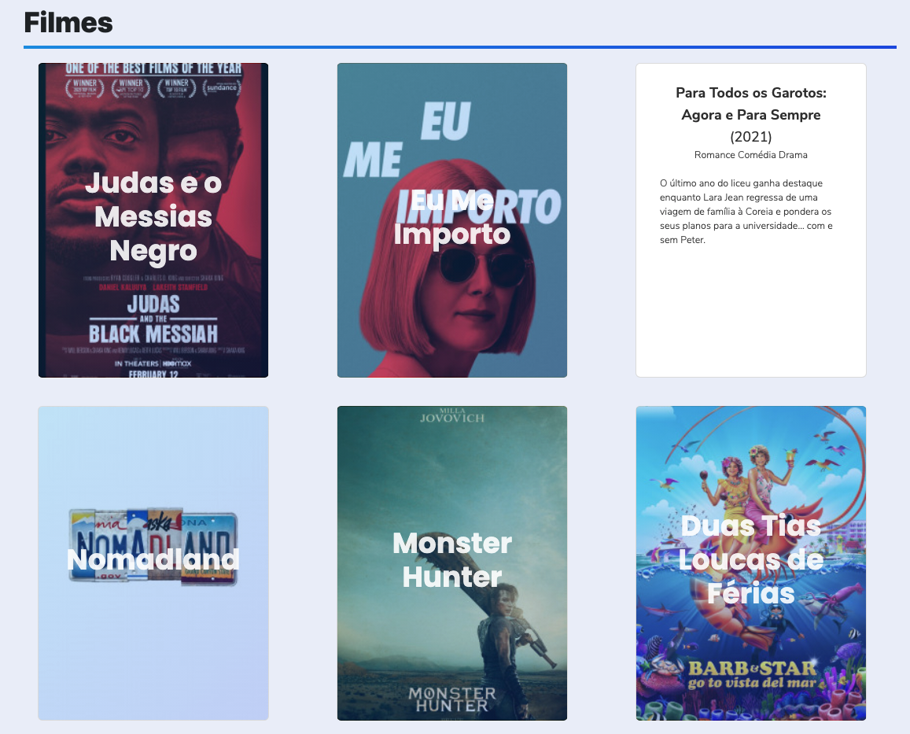
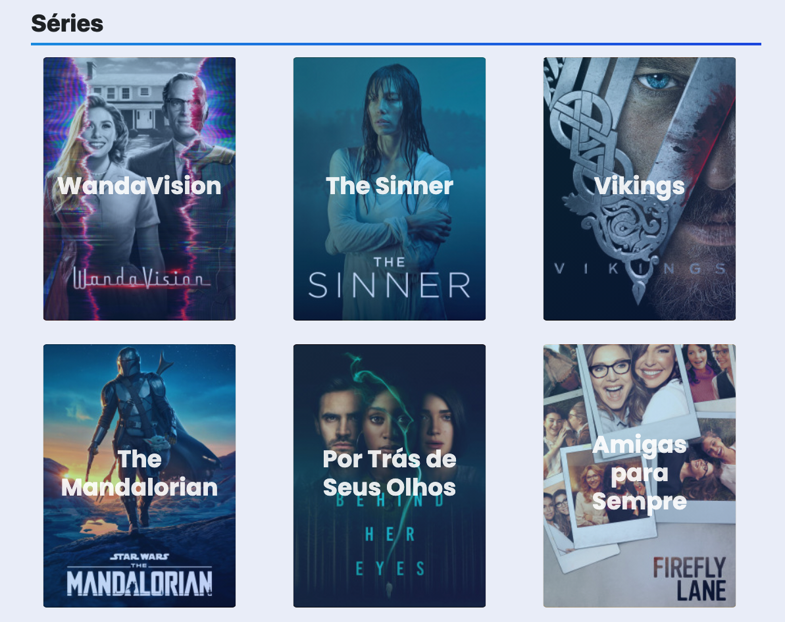

# Popular Series Movies

Esse foi o meu primeiro projeto em React, totalmente sozinho, sem seguir alguma aula/tutorial. A ideia deste projeto é fazer uma lista de filmes e séries populares do momento.

Me coloquei como objetivo usar apenas o React e os seus hooks, por se tratar de uma aplicação simples, não quis utilizar do Redux.

Esse layout foi totalmente inspirado no seguinte projeto: https://codepen.io/rogergcc/full/rrrNdy
Todos créditos do layout ao autor @rogergcc

## Run

yarn &&
yarn start